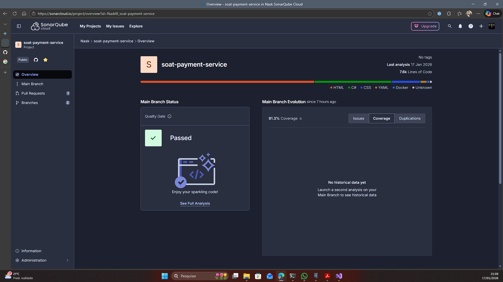

# 🍔 Sistema de Autoatendimento para Lanchonete - Fase 2

## 📖 Visão Geral

Este projeto é a segunda fase do sistema de autoatendimento para uma lanchonete, desenvolvido como parte do Tech Challenge da FIAP. A solução foi evoluída para uma implementação robusta utilizando **Clean Architecture**, com deploy e orquestração de containers via **Kubernetes**, garantindo escalabilidade, resiliência e segurança.

O sistema gerencia todo o fluxo de um pedido, desde a seleção de produtos pelo cliente até a confirmação de pagamento assíncrona (via Webhook do Mercado Pago) e o envio para a cozinha.

## ✨ Principais Funcionalidades e Conceitos (Fase 2)

* **Clean Architecture:** Separação clara de responsabilidades em camadas (`Domain`, `Application`, `Infrastructure`, `API`).
* **Kubernetes (K8s):** Orquestração completa da aplicação e do banco de dados, com deploy declarativo através de manifestos YAML.
* **Escalabilidade Automática (HPA):** Configuração do Horizontal Pod Autoscaler para escalar a API horizontalmente com base no uso de CPU.
* **Segurança:** Uso de `Secrets` para dados sensíveis (tokens, connection strings) e `ConfigMaps` para configurações de ambiente.
* **Pagamento Assíncrono:** Integração real com a API do Mercado Pago para geração de QR Code PIX e confirmação de pagamento via Webhook.
* **Fila de Pedidos Ordenada:** Endpoint que lista os pedidos ativos com uma ordenação customizada para a cozinha (`Pronto > Em Preparação > Recebido`).

## 🚀 Arquitetura da Solução

A arquitetura foi desenhada para ser desacoplada e escalável. O núcleo de negócio é protegido de dependências externas, e a infraestrutura como código no Kubernetes permite um deploy consistente em qualquer ambiente.



## 🛠️ Tecnologias Utilizadas

* **.NET 9**
* **Entity Framework Core**
* **PostgreSQL**
* **Kubernetes** (Orquestração)
* **Docker** (Containerização)
* **API do Mercado Pago**
* **Scalar** (Documentação da API)

## ⚙️ Guia de Execução (Deploy no Kubernetes)

Siga os passos abaixo para executar a aplicação em um ambiente Kubernetes local (Docker Desktop ou Minikube).

### Pré-requisitos

* **Docker Desktop** (com Kubernetes habilitado) ou **Minikube**.
* **`kubectl`** instalado e configurado para apontar para o seu cluster local.
* Uma conta no **Docker Hub** para hospedar a imagem da aplicação.

### Passo 1: Configuração de Segredos

Antes de iniciar, é necessário configurar seus dados sensíveis.

1.  **Edite o arquivo `k8s/secret-api.yaml`:**
    * Preencha o valor de `DB_CONNECTION_STRING` (se necessário, o padrão já deve funcionar com o banco que sobe no cluster).
    * Preencha o valor de `MP_ACCESS_TOKEN` com seu token do Mercado Pago. (O atual já deve funcionar.)
2.  **Edite o arquivo `k8s/secret-postgres.yaml`:**
    * Altere a senha padrão do Postgres (`POSTGRES_PASSWORD`), se desejar. Lembre-se de atualizar a `DB_CONNECTION_STRING` no outro arquivo, caso mude.

### Passo 2: Construir e Enviar a Imagem Docker

1.  **Faça o build da imagem:** Na raiz do projeto, execute:
    ```sh
    docker build -t SEU_DOCKER_ID/fastfood-api:v1 .
    ```
2.  **Faça o login no Docker Hub:**
    ```sh
    docker login
    ```
3.  **Envie a imagem para o repositório:**
    ```sh
    docker push SEU_DOCKER_ID/fastfood-api:v1
    ```
    *Lembre-se de substituir `SEU_DOCKER_ID` pelo seu usuário do Docker Hub e garantir que o repositório seja público.*

### Passo 3: Fazer o Deploy no Kubernetes

1.  **Aplique todos os manifestos:** Na raiz do projeto, execute o comando que cria todos os recursos (Deployments, Services, Secrets, etc.):
    ```sh
    kubectl apply -f k8s/
    ```
2.  **Aguarde os pods iniciarem:** Monitore o status com o comando abaixo até que todos os pods estejam com o status `Running`.
    ```sh
    kubectl get pods --watch
    ```

### Passo 4: Acessar a Aplicação

O serviço da API é exposto via `LoadBalancer`. No Docker Desktop, isso significa que ele estará acessível em `localhost`.

1.  **Descubra a porta:** Execute o comando e veja a porta mapeada na coluna `PORT(S)`.
    ```sh
    kubectl get service api-service
    ```
2.  **Acesse a API:** A URL base será `http://localhost:8081`.

## 📄 Documentação da API (Scalar)

A documentação interativa da API, gerada pelo Scalar, pode ser acessada no seguinte endpoint após o deploy:

* **[Scalar](http://localhost:8081/scalar/v1)**

## 🎥 Vídeo de Demonstração

Um vídeo demonstrando a arquitetura em funcionamento, os endpoints da API e o fluxo de pagamento pode ser encontrado no link abaixo:

* **[LINK PARA O VÍDEO NO YOUTUBE](https://youtu.be/fGttNHXnPjU)**

## 🧑‍💻 Autor

Projeto desenvolvido por **Raphael Nascimento** para a pós-graduação em Arquitetura de Software na FIAP.
